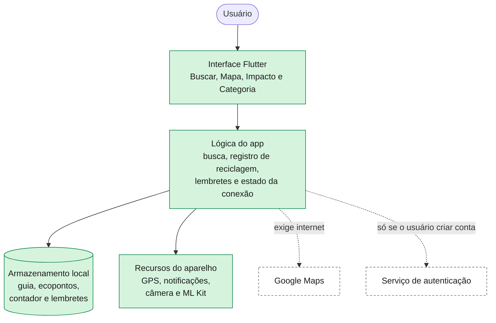

# Justificativas das decisões de interface e arquitetura

Este documento registra o porquê das principais decisões do protótipo de alta fidelidade
do LixoZero (Atividade 04, item 2.4), ligadas ao estudo de caso, às personas (Marina e
Profa. Ana Beatriz) e aos requisitos (RF e RNF).

## 1. Escolha das cores (paleta e contraste)

O código de cores da coleta seletiva é obrigatório (estudo de caso, item 2.7, e RNF09).
Mantivemos as três cores do briefing (azul para papel, vermelho para plástico, verde para
vidro) e estendemos para metal, orgânico e perigoso.

| Uso | Cor |
|---|---|
| Papel (azul) | `#2D8CFF` |
| Plástico (vermelho) | `#FF2D2D` |
| Vidro (verde) | `#28A745` |
| Metal (amarelo) | `#FFC107` |
| Orgânico (marrom) | `#8C592D` |
| Perigoso (laranja) | `#FF8C2D` |
| Marca: verde escuro, médio e claro | `#007F3D`, `#43AD7A`, `#D6F4DD` |
| Fundo da tela | `#F6FCF5` |
| Texto principal e secundário | `#1A1A1A`, `#666666` |

Medimos o contraste (WCAG, mínimo de 4,5:1 para texto comum) e isso guiou as decisões abaixo:

| Par de cores | Contraste | Decisão |
|---|---|---|
| Texto `#1A1A1A` sobre o fundo | 16,7:1 | Texto principal |
| Texto `#666666` sobre o fundo | 5,5:1 | Texto de apoio |
| Branco sobre verde escuro `#007F3D` | 5,1:1 | Fundo dos botões primários |
| Branco sobre verde médio `#43AD7A` | 2,8:1 | Não usar como fundo de botão nem para texto pequeno; fica para detalhes e indicadores |
| Cor da categoria sobre branco (azul 3,3; vermelho 3,7; verde 3,1; laranja 2,3; amarelo 1,6) | abaixo de 4,5:1 | O nome da categoria vai em texto escuro; a cor fica no ícone, no ponto e nas ilustrações |

Os cards de categoria ficam brancos e a cor entra em doses pequenas. Preencher o card
inteiro com vermelho ou laranja seria lido como erro ou alerta (plástico não é perigoso),
e seis cores saturadas juntas cansam a vista e contrariam o modo claro calmo do RNF11. O
verde da marca também é o da categoria Vidro, então a marca aparece em botões, navegação
e mascote, e o verde de Vidro só junto da lixeira e do nome da categoria.

## 2. Tipografia (hierarquia e legibilidade)

Usamos duas fontes sem serifa, ambas gratuitas. A Montserrat, geométrica e amigável, está
nas telas de conteúdo educativo (Buscar, Categorias e Mapa). A Inter, desenhada para
interfaces e com números muito legíveis, está na tela Impacto e nas janelas de lembrete,
onde aparecem o contador em quilos, horários e formulários. Duas famílias mantêm o app
leve para um aparelho básico (RNF04).

A hierarquia tem quatro níveis: título da tela (24 px, negrito), nome do item ou
categoria (negrito), texto de instrução (12 a 15 px, regular) e rótulos pequenos. Para
legibilidade, parágrafos ficam em caixa normal e a caixa alta só aparece em rótulos
curtos, porque atrapalha a leitura de quem tem menos letramento (estudo de caso e RNF08).
As linhas são curtas e a linguagem não usa termos técnicos.

## 3. Organização das informações (disposição e fluxo visual)

Toda tela segue a mesma ordem de cima para baixo: aviso "offline disponível" e mascote,
título, conteúdo em cards (com o campo de busca na tela Buscar) e navegação embaixo, onde
o polegar alcança com uma mão só. O card é a unidade de conteúdo (resultado, categoria,
ecoponto, lembrete), então o usuário aprende um padrão só.

A tela Buscar dá a instrução de descarte do item específico (o que fazer agora). A tela
Categorias dá a definição geral, exemplos e ilustrações dos materiais, com todas as
categorias abertas numa rolagem só para comparar sem tocar. A tela Impacto reúne o
contador e os lembretes para respeitar o limite de quatro telas principais (RNF10).

## 4. Navegação (fluxos, menus e facilidade de localização)

A barra inferior é fixa, com quatro itens na ordem Buscar, Mapa, Impacto e Categoria,
cada um com ícone e rótulo, e o item ativo em verde. Ícone mais texto ajuda quem não
reconhece só o símbolo, e a posição fixa mostra sempre onde o usuário está.

O fluxo principal tem poucos toques (RNF02): abrir, digitar o resíduo, tocar em Buscar e
ver o resultado na mesma tela. Depois, "Registrar reciclagem" é um toque e "Ver pontos de
coleta" leva ao Mapa.

O login é opcional: o usuário pode criar conta, entrar com e-mail ou Google, ou tocar em
"Não quero fazer login" e usar o app inteiro sem cadastro. As telas de acesso ficam fora
das quatro principais (RNF10) e aparecem na primeira abertura, com a escolha guardada no
aparelho, para não acrescentar um passo ao fluxo de busca em todo uso (RNF02).

## 5. Componentes (elementos de UI utilizados)

- Barra de navegação inferior e campo de busca com lupa, botão "Buscar" e câmera (RF08).
- Cards de resultado, de categoria, de ecoponto e de lembrete, com rótulo de categoria
  (ponto colorido mais nome) e etiqueta "Cooperativa".
- Botões em três níveis: preenchido para a ação principal ("Buscar", "Registrar
  reciclagem"), contorno para a secundária ("Ver pontos de coleta") e tracejado para criar
  algo pouco frequente ("+ Novo lembrete").
- Toast de confirmação ("Registrado! +0,03 kg") com link opcional "ajustar peso".
- Aviso "offline disponível" e estado de "sem conexão" no mapa, com a lista de ecopontos
  ainda visível.
- Dica de reciclagem rotativa, que abre num cartão com o mascote e o botão "Entendi".
- Janelas de lembrete (adicionar e editar, com horário, título e dias da semana),
  botões de editar e excluir e confirmação antes de apagar.
- Telas de acesso opcional: criar conta, verificação por e-mail, entrar, "Continuar com
  Google" e "Não quero fazer login", com o botão de pular tão visível quanto os outros.
- Mascote Brotinho, com poses por contexto (acenando, comemorando, dica, busca, mapa,
  lembrete e sem conexão). Ele reforça o tom "didático, verde e comunitário" do briefing
  e nunca é a única forma de informar algo.

O registro de reciclagem é um toast, e não um pop-up pedindo o peso, porque o RF09 pede
registro automático, ninguém sabe de cabeça quanto pesa uma garrafa e o uso é com as mãos
ocupadas. Cada item do guia tem um peso médio estimado, somado ao contador sozinho.

A dica do rodapé da tela Buscar é rotativa. O protótipo mostra uma ("Dica: compostagem"),
e no app o espaço alterna entre dicas curtas de reciclagem, como compostagem, enxaguar
embalagens ou onde levar pilhas, então o RF06 continua coberto. Uma dica sempre igual vira
ruído, e trocar a dica educa mais, em linha com a missão do projeto. As dicas ficam numa
lista dentro do app (funciona sem internet, RNF03, e sem coletar dados, RNF06) e mudam a
cada busca ou abertura, e não por temporizador, para não distrair nem gastar bateria.

## 6. Acessibilidade (padrões de inclusão do estudo de caso)

O estudo de caso pede o código de cores universal "inclusive em situações de baixa
atenção ou letramento" (item 2.7), modo claro com alto contraste (item 2.3) e interface
simples para níveis diferentes de familiaridade digital. O protótipo responde assim:

- Contraste mínimo de 4,5:1 em textos, conforme a tabela da seção 1.
- A cor nunca é o único sinal: cada categoria tem nome em texto ("Plástico"), nome da
  lixeira ("Lixeira Vermelha") e ícone, o que ajuda também quem não distingue bem cores.
- Modo claro fixo (RNF11), sem caixa alta em parágrafos e com linguagem simples (RNF08).
- Poucos toques por tarefa e navegação ao alcance do polegar, para uso com uma mão só.
- Avisos importantes (offline, confirmação, erro de conexão) vêm em texto, além do
  mascote ou da cor.

## 7. Decisões relacionadas ao contexto de uso (condições e ambiente)

- Cozinhas, varandas e escolas, com ambiente claro: modo claro e alto contraste.
- Mãos ocupadas e pouca atenção, como a Marina, que precisa de uma resposta rápida no meio
  de uma tarefa doméstica: ações em um toque e nenhum campo de texto obrigatório no fluxo
  principal além da busca.
- Internet fraca: o guia funciona sem conexão (RNF03) e o aviso "offline disponível" fica
  nas telas principais. Só o mapa exige internet, e nesse caso um estado próprio explica
  o que houve (RF10, RNF12). A lista de ecopontos já carregada continua visível, porque
  fica salva no aparelho.
- Smartphones básicos: poucas telas, imagens leves e nada de processamento pesado (RNF04).
- Escolas, como a Profa. Ana Beatriz: o contador e as poses do mascote dão um resultado
  visível para a turma, e o guia offline funciona mesmo com a internet instável da sala.

## 8. Arquitetura do sistema (visão geral e componentes)

O LixoZero é um app móvel em Flutter (Dart), com um único código para Android e iOS,
pensado para funcionar primeiro sem internet (offline first). Sem conta, nenhum dado
pessoal é coletado e nada sai do aparelho (RNF06 e RNF07). Essa é a arquitetura prevista
para a Unidade II.

| Componente | Função no projeto | Sem internet |
|---|---|---|
| Flutter e Dart | Um código para Android e iOS, leve em aparelhos básicos (RNF04, RNF05) | Sim |
| Armazenamento local no aparelho (por exemplo, SQLite) com JSON inicial | Guia de classificação (RF01, RF05), ecopontos (RF02), contador anônimo (RF03, RF09, RNF07, RNF14) e lembretes (RF04) | Sim |
| Google Maps (google_maps_flutter) | Mapa e marcadores dos ecopontos (RF02, RNF13) | Não, o app avisa (RF10) |
| Recursos do aparelho (geolocator, connectivity_plus, flutter_local_notifications, image_picker e google_mlkit_image_labeling) | GPS para ordenar ecopontos, detecção de falta de internet (RF10, RNF12), lembretes (RF04) e reconhecimento de imagem no aparelho (RF08, secundário) | Sim |
| Autenticação opcional (por exemplo, Firebase Authentication) | Criar conta e entrar com e-mail ou Google, só para quem escolher | Não |

O guia e os ecopontos entram no armazenamento local por um JSON incluído no app, cadastrado pela equipe
a partir de fontes públicas (tabela CRUD do `requisitos.md`). Quem cria conta tem nome,
sobrenome e e-mail tratados pelo serviço de autenticação, só por escolha, com o mínimo
necessário e conforme a LGPD (Lei 13.709/2018). Os requisitos RF11 e RF12 pedem servidor
próprio e ficam fora do protótipo.

Dados locais atendem a internet instável e os aparelhos simples, o cadastro opcional
preserva o compromisso de privacidade, e o Flutter entrega Android e iOS com integração
oficial ao Google Maps.
